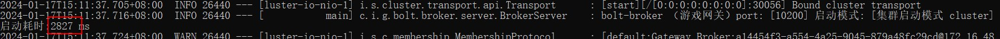
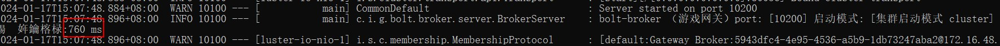
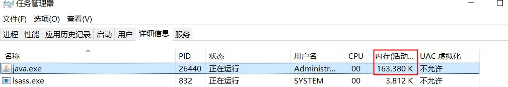
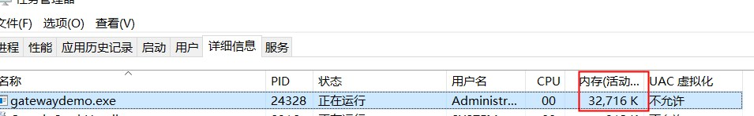

# ioGame游戏框架集成SpringBoot+GraalVM 编译运行，性能提升N倍

## 说明

* ioGame是一款优秀的基于java的高性能的游戏服务端框架，详情可查看 https://gitee.com/game-town/ioGame
* 目前很多Java项目都开始支持[GraalVM](https://www.graalvm.org/)，于是拿ioGame游戏服务框架练手，使相关服务支持native-image编译运行；
* 该demo基于 ioGame 17.1.22的版本，其他最新版本可以参考该demo;
* demo工程：
    * 网关服务:gatewaydemo
    * 对外服务:gameexternaldemo
    * 逻辑服务:gameserverdemo
    * 客户端模拟服务:gameclientdemo

## 启动耗时对比（以网关服务为例）

* 基于JVM启动耗时： 约2.8s
  

> 说明：该示例因为基于springboot，所以启动耗时稍长；如果不基于springboot框架，启动ioGame的相关服务实际会很快

* native方式启动耗时：约760ms,仅为JVM的1/3左右
  

## 内存占用对比 （以网关服务为例）

* 基于JVM运行时，内存占用 约160M
  

* native方式运行，内存占用 约32M，仅为JVM的1/5左右
  

## 编译

* 网关服务(`gatewaydemo`)、对外服务(`gameexternaldemo`)、逻辑服务(`gameserverdemo`) 可以运行工程在的 `native-build.bat`
  进行编译，或者直接使用mvn命令：

```shell
 mvn clean install -P native native:compile "-Dmaven.test.skip=true" -X
```

* 客户端模拟服务(`gameclientdemo`): 直接mvn编译，暂不支持native-image编译

## 注意事项

* 逻辑服务中使用了ClassScanner，在native模式下暂时没有找到合适的方法支持，因此在native-image编译时替换scan相关方法
    * 务必在工程中手动创建 `GameActionDocWrapper.java`,初始化代码如下：
      ```java
      public class GameActionDocWrapper {
          public static final Set<Class<?>> classSet = new HashSet<>(){{
              
          }};
      }
      ```
  > 在native-image编译时，会查找ActionController、DocSends注解的相关类，并添加到`GameActionDocWrapper`中

* 逻辑服务中使用了`MethodAccess`、`ConstructorAccess`
  ，在native模式下暂时没有找到合适的方法支持，因此在native-image编译时替换了`MethodAccess.get`
  和`ConstructorAccess.get方法`
* 在对外服务和逻辑服务中，均使用了proto对象，必须使用`jprotobuf-precompile-plugin`
  插件，确保在编译时能正确的生成对应的`$$JProtoBufClass`类

* 逻辑服务中的`pom.xml`中`native-maven-plugin`配置节点下需要增加

```xml

<buildArg>--features=com.iogamegraalvmdemo.gameserverdemo.graal.GameRuntimeHintsFeature</buildArg>
```

